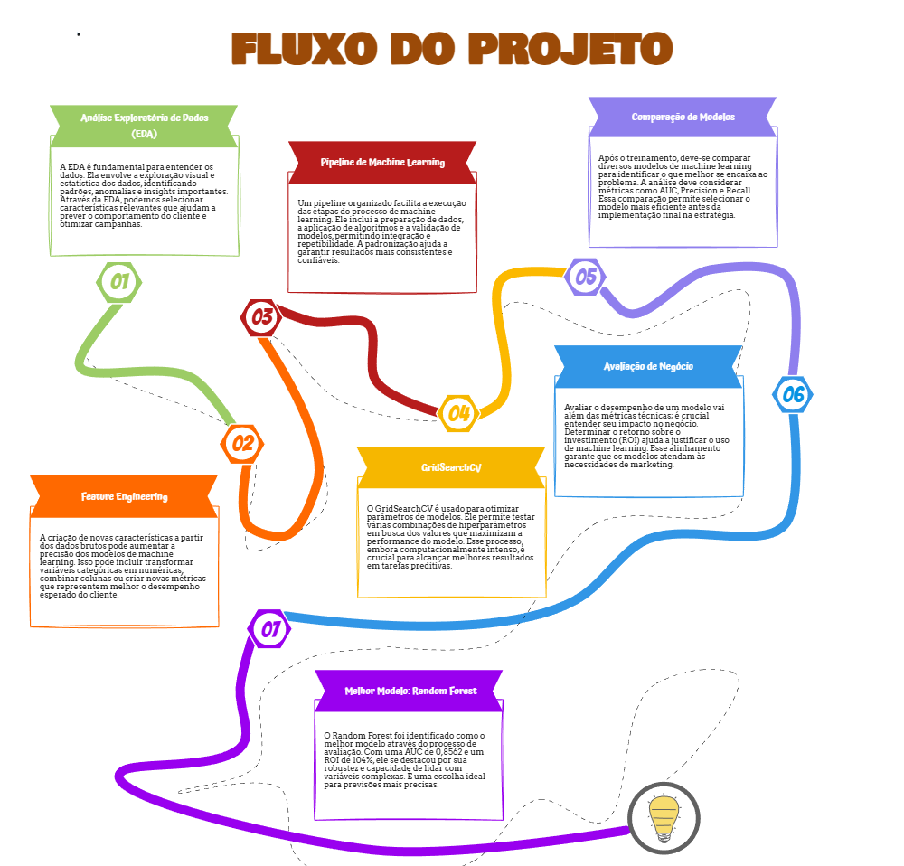
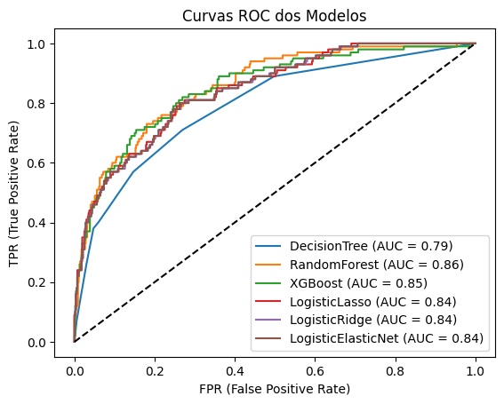
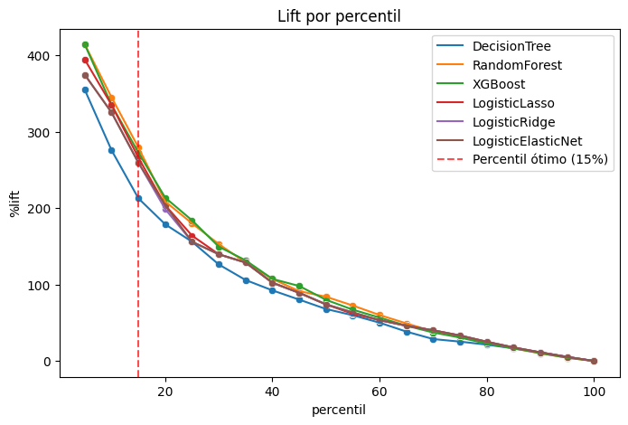
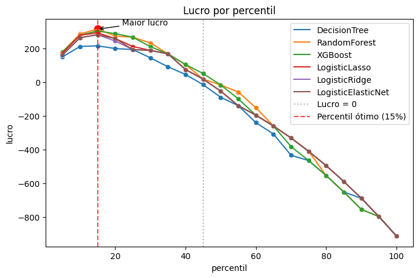
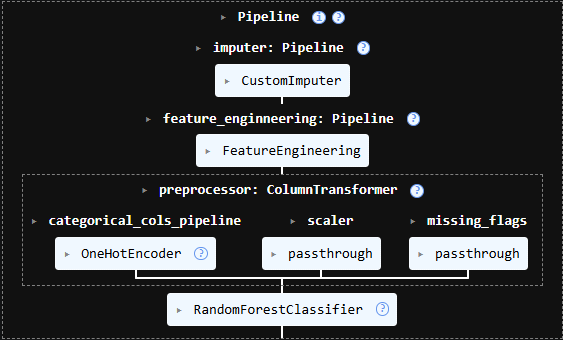

# Predição de Propensão de Compra para Campanhas de Marketing

> Modelo de Machine Learning para otimização de campanhas de marketing direto.
## Principais resultados

* Melhor modelo: Random Forest

* AUC:  0,8562

* Lift Top 15%: 279,25%

* Taxa de resposta: 56%

* Lucro máximo no Top 15%

* ROI esperado: 104%

## Visão Geral

Uma empresa do setor varejista realizou uma campanha piloto com **2.240 clientes**, obtendo:

- Taxa de resposta: **15%**
- Receita: **3.674 MU**
- Custo da campanha: **6.720 MU**
- Lucro: **-3.046 MU**

Este projeto tem como objetivo desenvolver um modelo de Machine Learning capaz de identificar **qual o grupo de clientes deve ser contatado para maximizar o lucro da campanha de marketing**.

---

# Metodologia

---

# Modelos Avaliados

Foram avaliados diversos modelos de classificação:

| Modelo              | Melhor Percentil |      Lucro |         ROI |        Lift | Taxa de Resposta |
| ------------------- | ---------------: | ---------: | ----------: | ----------: | ---------------: |
| Decision Tree       |              15% |     215,85 |      71,24% |     212,71% |              47% |
| Logistic Ridge      |              15% |     282,08 |      93,10% |     259,29% |              53% |
| Logistic ElasticNet |              15% |     282,08 |      93,10% |     259,29% |              53% |
| Logistic Lasso      |              15% |     293,12 |      96,74% |     265,94% |              54% |
| XGBoost             |              15% |     304,16 |     100,38% |     272,59% |              55% |
| **Random Forest**   |          **15%** | **315,20** | **104,03%** | **279,25%** |          **56%** |

---
# Avaliação da Campanha

A seleção dos clientes foi realizada utilizando percentis da probabilidade prevista pelo modelo.

Principais resultados:

- Melhor estratégia: **Top 15% dos clientes**
- Taxa de resposta: **56%**
- Lift: **279,25%**
- Campanha passa a apresentar prejuízo após aproximadamente **45% da base**.

---

# Simulação Financeira

Simulação realizada para uma campanha com **1.000.000 de clientes**.

## Premissas

- Custo por contato: 3 MU
- Receita média por comprador: 10,93 MU

## Estratégia

Contato apenas dos **15% clientes com maior score**.

| Indicador | Valor |
|------------|-------:|
| Clientes contatados | 150.000 |
| Taxa de resposta | 56% |
| Compradores esperados | 84.000 |
| Receita esperada | 918.120 MU |
| Custo total | 450.000 MU |
| Lucro esperado | **468.120 MU** |
| ROI | **104%** |

> Esta simulação considera que a população futura apresenta comportamento semelhante ao observado na campanha piloto.

---

# Tecnologias Utilizadas

- Python
- Pandas
- NumPy
- Scikit-Learn
- Random Forest
- Matplotlib
- Seaborn
- SciPy
- Statsmodels
- Jupyter Notebook

---

# Principais Aprendizados

Durante o desenvolvimento deste projeto foram aplicados conceitos de:

- Engenharia de Atributos
- Pipeline
- Avaliação estatística de modelos
- VIF
- Linearidade do Logito
- Curva ROC
- AUC
- Precision x Recall
- Lift
- Threshold por Percentis
- ROI
- Lucro Esperado
- Modelagem orientada ao negócio

---

# Conclusão
Este projeto demonstra como técnicas de Machine Learning podem apoiar decisões estratégicas de marketing.

A utilização do modelo Random Forest permitiu identificar o grupo de clientes com maior propensão de compra, elevando a taxa de resposta de aproximadamente **15% para 56%** e maximizando o lucro esperado da campanha por meio da segmentação da base de clientes.

Ao selecionar apenas os 15% clientes com maior probabilidade de compra, o modelo concentra aproximadamente 56% de compradores nesse grupo (taxa de resposta), proporcionando um Lift de cerca de 279%, ROI de 104% e o maior lucro esperado da campanha.

---

## Autor

**Alexandre Moreira Andréo**

- 🔗 [Linkedin](https://www.linkedin.com/in/aandreo/)
